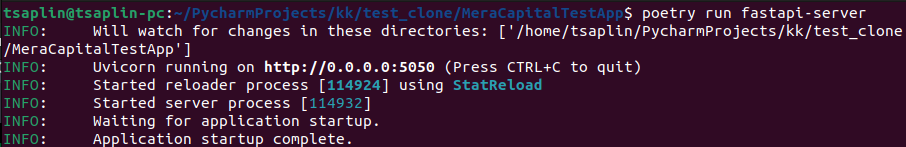
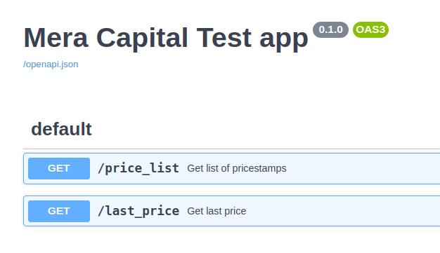
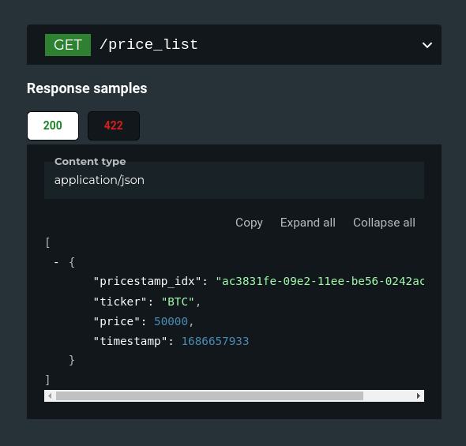
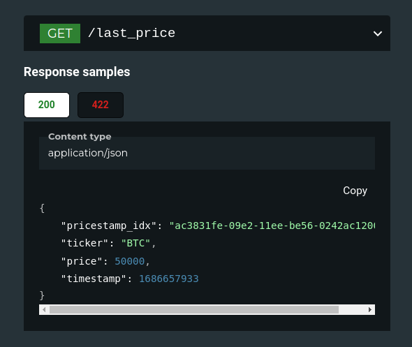
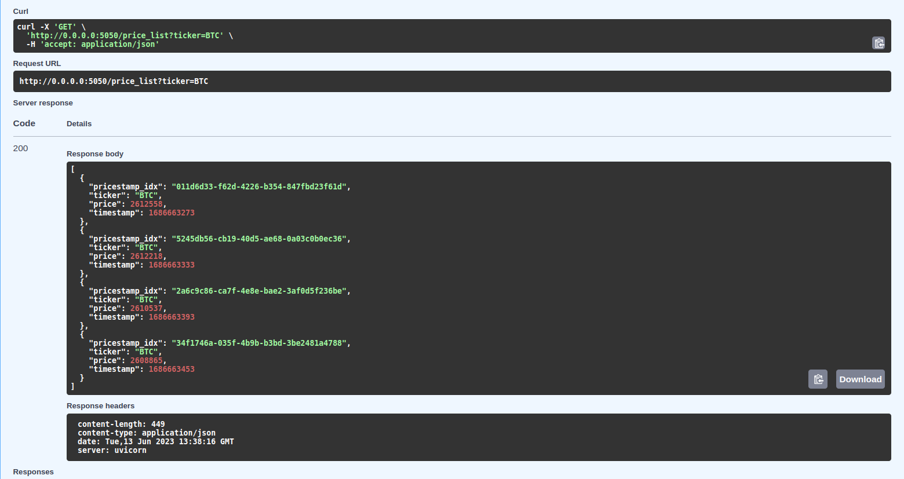
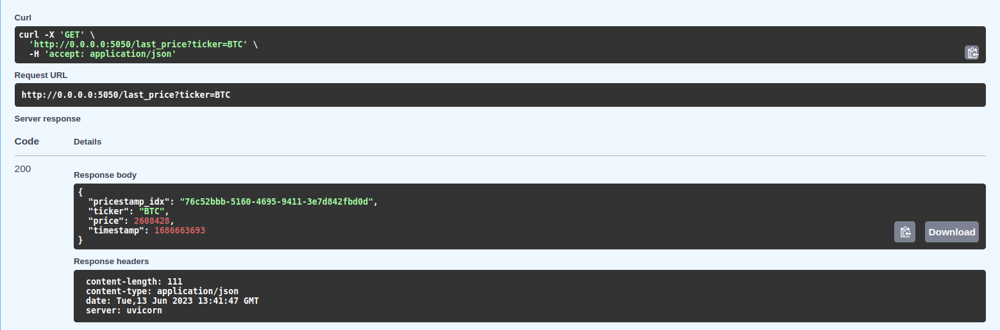

# MeraCapitalTestApp
Тестовое задание для Mera Capital
## Подготовка к запуску
1. Клонируем проект  
`$ git clone https://github.com/TsaplinIA/MeraCapitalTestApp`  
`$ cd MeraCapitalTestApp/`
2. Устанавливаем зависимости  
`$ poetry install`
3. При необходимости устанавливаем переменные окружения описанные в .env.example.
Этот шаг не обязателен
4. Запускаем докер сервис с базой данных  
`$ docker compose up`
5. Проводим миграции баззы данных  
`$ poetry run alembic upgrade head`

## Запуск

1. Для запуска сканера Deribit:  
`$ poetry run scanner`
2. Для запуска сервера с API:  
`$ poetry run fastapi-server`
3. Для запуска тестов(в данном случая лишь одного):  
`$ poetry run pytest`

## Демонстрация
#### 1. Подготовка к запуску

#### 2. Запуск сканнера

#### 3. Запуск сервера с API  
Запускаем сервер

Swagger по адресу ".../docs"

Redoc по адресу ".../redoc"

Результаты запросов на сервер(через Swagger)

## Тестовое задание
Тестовое задание на позицию junior back-
end разработчика   
### Стек:  
1. asyncio
2. aiohttp
3. apscheduler
4. sqlalchemy 2.0+ (async)
5. postgresql
6. fastapi
7. dataclasses
8. pytest-asyncio/pytest
### Задание
1. Написать для криптобиржи Deribit асинхронный клиент на aiohhtp.
Клиент должен каждую минуту забирать с биржи текущую цену BTC и ETH, после
чего сохранять в базу данных тикер валюты, текущую цену и время в UNIX.
2. Написать внешнее API для обработки сохраненных данных на FastAPI.
Должны быть следующие методы:
   1. Получение всех сохраненных данных по указанной валюте
   2. Получение последней цены валюты
   3. Получение цены валюты с фильтром по дате
Все методы должны быть GET и у каждого метода дожен быть обязятельный query-
параметр "ticker".
Вместо pydantic-моделей желательно использовать dataclass-модели.
3. Написать тесты для клиента
Написать простой тест на метод получения данных с биржи.
### Критерии оценки
1. Чистая архитектура/чистый код
2. Нейминг
3. Отсутсвие глобальных переменных
4. Скорость выполнения работы
5. Умение использовать ООП